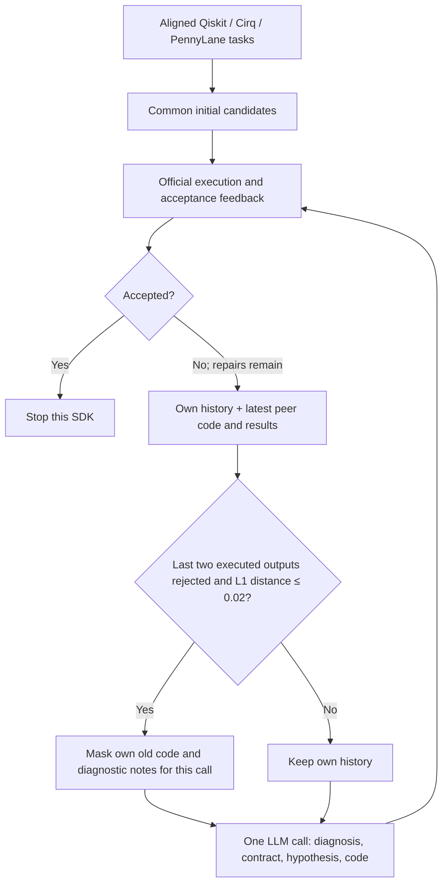

# QuanBench Repair

A research artifact for quantum-circuit generation on **QuanBench+**, comparing
one-shot generation, independent feedback repair, and repair with private diagnostic
notes, cross-SDK code sharing, and conditional context masking.

All three conditions use **GPT-6 Astra through Codex, reasoning effort `medium`**.
The repair conditions allow at most five repairs after a common initial generation.

## Selected measured results

| Condition | Accepted / 126 | Acceptance rate |
|---|---:|---:|
| One-shot generation | 74 | 58.7% |
| Independent feedback repair | 99 | 78.6% |
| Cross-SDK repair with conditional context masking | 108 | 85.7% |
| No cross-SDK information, with conditional context masking (two runs) | 103, 103 | 81.7%, 81.7% |
| No cross-SDK information, without conditional context masking (one run) | 102 | 81.0% |

The first three rows are **selected development-run results**, not averages or held-out results.
The last two rows are follow-up ablations using the same initial candidates and
at most five repairs. The one-case gap does not establish a masking benefit;
the numbers of repetitions differ. See [the no-sharing comparison](docs/ablation/NO_PEER_RESTART_COMPARISON.md).
The 108-case run does not establish that context masking caused the improvement.
A later fresh-repair repetition of this architecture scored 107/126.
Read [Results and limitations](docs/RESULTS.md) before interpreting the comparison.

## Additional information-ablation results

The release also contains two follow-up comparisons. Showing the latest peer code
gave 107/126 and 110/126 in two fresh runs, while masking only that code gave
107/126 and 107/126. Removing every task-specific peer field (peer prompt, code,
acceptance, output, error, and history) gave 103/126 in both runs; retaining peer
outcomes and history gave 106/126 and 107/126. These are official acceptance
counts, not claims of mathematical correctness. The paired differences are
suggestive, but their predeclared bootstrap intervals include zero.

See [code visibility](docs/ablation/PEER_CODE_ABLATION_RESULTS.md),
[all peer information](docs/ablation/NO_PEER_RESULTS.md), and the machine-readable
records under `results/ablation/`. The audits verify the actual model inputs,
including that the all-information-hidden condition sent an empty peer-evidence
list and only the current SDK's history.

Every score in the selected comparison table now has a complete 126-case
trajectory, including failed cases and intermediate attempts: 756 case outcomes
and 1,575 record entries across six trajectories. They represent 945 distinct
model calls when the common 126 initial calls are counted once. See the
[evidence inventory](docs/EVIDENCE.md). The other information ablations retain
all case outcomes, action metadata and actual-input audits; their full raw
candidate histories are not claimed as part of this evidence set.

## Verify the reported numbers — no model or benchmark download

```bash
python3 scripts/audit_results.py
python3 scripts/audit_ablation_results.py
python3 scripts/audit_no_peer_no_restart.py
python3 scripts/audit_no_peer_restart_full.py
```

This checks file hashes, case coverage, initial-code reuse, stopping rules, budgets,
and token totals. It regenerates [the table](results/table.md) and
[case-level CSV](results/cases.csv). It does not execute circuits.
The second command verifies the eight additional ablation trajectories, their
1,008 paired case outcomes, source hashes, and the all-information-hidden input
audit. It regenerates `results/ablation/cases.csv` and does not call an LLM.
The last two commands verify the complete 102 trajectory and both complete
103 trajectories, including saved code and evaluation histories.

## Install for circuit evaluation or fresh generation

Tested on Linux, Python 3.11. The sandbox requires `bubblewrap` (`bwrap`).
Install it with your distribution's package manager, for example:

```bash
sudo apt-get install bubblewrap
uv venv --python 3.11 .venv
uv pip install --python .venv/bin/python -r requirements.lock
mkdir -p vendor
git clone https://github.com/JawadKotaichh/quanbench-plus.git vendor/quanbench-plus
git -C vendor/quanbench-plus checkout 2dfd1a863b13d3762a734ed96742adb39e65e34b
```

Upstream benchmark data and reference solutions are fetched separately, not bundled.
Some Linux hosts disable unprivileged namespaces; `bwrap` must work on the host.
Use the `.venv/bin/python` interpreter for evaluation.

### Re-evaluate saved final circuits — no LLM calls

```bash
.venv/bin/python scripts/replay.py oneshot --output runs/replay_oneshot
.venv/bin/python scripts/replay.py feedback --output runs/replay_feedback
.venv/bin/python scripts/replay.py restart --output runs/replay_restart
.venv/bin/python scripts/replay.py no_peer_restart_r1 --output runs/replay_no_peer_restart_r1
.venv/bin/python scripts/replay.py no_peer_restart_r2 --output runs/replay_no_peer_restart_r2
.venv/bin/python scripts/replay.py no_peer_no_restart --output runs/replay_no_peer_no_restart
```

Each command evaluates all 126 saved final candidates and reports differences from
the archived acceptance labels. Use `--ids 01` for a three-SDK smoke test.
Every output directory must be new. Saved results remain immutable.

### Generate new repairs from the published initial candidates

Fresh generation additionally requires an authenticated Codex CLI and access to
`gpt-6-astra`. This release preserves the recorded CLI invocation; model access and
CLI feature support must be checked in the reader's environment.

```bash
.venv/bin/python scripts/restore_initial.py
.venv/bin/python -m qagent feedback --run feedback_new \
  --initial-run published_initial --attempts 6 --workers 3
.venv/bin/python -m qagent restart --run restart_new \
  --initial-run published_initial --attempts 6 --workers 6
```

To generate a new initial set as well:

```bash
.venv/bin/python -m qagent oneshot --run initial_new --workers 3
```

Use `--initial-run initial_new` for subsequent repair runs. New generations are
stochastic; neither command promises the published score. Do not run two processes
with the same run name. Resume with the exact same arguments.

To run fresh versions of all six table conditions after setup and Codex
authentication, use `make fresh`. It creates a new common initial set, one
one-shot run, one feedback run, one cross-SDK restart run, two no-sharing restart
runs and one no-sharing run without restart. These are stochastic replications,
not a command to regenerate the published trace.

### Information-ablation source

The code for the information-visibility conditions is included under `qagent/`
and the registered settings and archived scores are under `results/ablation/`.
Fresh model runs require a new registry with local run names and source hashes;
the archived trajectories must not be overwritten. The offline command
`scripts/audit_ablation_results.py` is the reproducible way to verify the
published ablation numbers without model access.

### Tests and input reconstruction

```bash
.venv/bin/python -m unittest discover -s tests -v
.venv/bin/python scripts/check_trace_parity.py
```

The second command requires the pinned benchmark prompts. It reconstructs all 445
model inputs using archived responses, without calling the model or executing
circuits, and checks hashes after the documented privacy redaction.

## Architecture



SDKs are processed in fixed order within each repair round. Other SDKs' diagnostic
notes are never shown. Peer code and observed results remain available even during
masking. The feature changes the context for one call; it does not start a new
repair budget. See [Protocol](docs/PROTOCOL.md).

## Repository map

- `qagent/`: the three supported conditions, prompts, Codex invocation and sandbox.
- `results/`: selected trajectories, code, evaluations, cost data, provenance hashes,
  and the two information-ablation datasets under `results/ablation/`.
- `scripts/`: offline audit, prompt reconstruction, initial restoration and circuit replay.
- `tests/`: budget, privacy, stopping and resume checks.
- `docs/`: protocol, results, provenance and license scope.

[日本語概要](docs/README_JA.md) · [Results](docs/RESULTS.md) ·
[Evidence inventory](docs/EVIDENCE.md) ·
[Reproducibility](docs/REPRODUCIBILITY.md) ·
[追加アブレーション](docs/ablation/NO_PEER_RESULTS.md) ·
[Protocol](docs/PROTOCOL.md) · [Provenance](docs/PROVENANCE.md)

## License and attribution

Original harness and utility code is provided under the [MIT License](LICENSE).
Benchmark materials, dependencies and generated artifacts have separate provenance;
see [Third-party notices](THIRD_PARTY_NOTICES.md). No paper title, authors, venue,
DOI or public repository URL is asserted by this pre-publication artifact.
